# Topologia Experimental de Roteamento Dinâmico (OSPF, RIP e BGP)

Trabalho de avaliação experimental e metrológica de desempenho entre os protocolos de roteamento dinâmico **OSPF**, **RIP** e **BGP**, sobre uma topologia virtualizada composta por 5 roteadores distribuídos em 3 Sistemas Autônomos (AS) independentes.

---

## 1. Arquitetura da Topologia e Decisões de Projeto

### 1.1 Diagrama Lógico da Rede

A topologia foi projetada em uma configuração **triangular** para garantir caminhos redundantes de comunicação entre os três Sistemas Autônomos:

```text
       [ AS 100 ]                      [ AS 200 ]
  +------------------+            +------------------+
  |  Router 1 (R1)   |            |  Router 3 (R3)   |
  |  10.100.0.2/24   |            |  10.200.0.2/24   |
  +--------+---------+            +--------+---------+
           |                               |
     (Rede Interna)                (Rede Interna)
     10.100.0.0/24                 10.200.0.0/24
           |                               |
  +--------+---------+            +--------+---------+
  |  Router 2 (R2)   +------------+  Router 4 (R4)   |
  |  10.100.0.3/24   | 172.25.12.0 |  10.200.0.3/24   |
  +--------+---------+    /29     +--------+---------+
           |                               |
 172.25.13.0/29                      172.25.23.0/29
           |                               |
           +---------------+---------------+
                           |
                     [ AS 300 ]
             +-------------+-------------+
             |      Router 5 (R5)        |
             |  10.30.0.2/24 (Rede LAN)  |
             +---------------------------+

```

### 1.2 O Uso do Docker e do Docker Compose

Para viabilizar a criação de múltiplos roteadores em uma única máquina sem exigir uma infraestrutura pesada de máquinas virtuais completas, optou-se pela utilização do **Docker** e do **Docker Compose**:

* **Virtualização Leve por Containers:** O Docker utiliza *namespaces* de rede e *cgroups* do kernel Linux para isolar cada roteador de forma independente. Isso permite executar 5 roteadores com consumo baixo de CPU e memória RAM, diferentemente de hypervisors tradicionais (como VMs) que exigiriam múltiplos sistemas operacionais completos instalados.
* **Orquestração Declarativa via Docker Compose:** O arquivo `docker-compose.yml` permite especificar toda a infraestrutura em código. Ele gerencia a criação automatizada das 6 sub-redes virtuais do tipo *bridge*, a atribuição estática de endereços IP em cada interface dos roteadores, as permissões de acesso privilegiado (`privileged: true`) necessárias para manipulação e o encaminhamento de pacotes IPv4 (`net.ipv4.ip_forward=1`).

### 1.3 Justificativa da Escolha da Plataforma (FRRouting)

A escolha da suíte de roteamento de código aberto **FRRouting (FRR)** versão `8.5.0` fundamenta-se nos seguintes aspectos:

* **Substituição Tecnológica:** O FRR é o *fork* direto, ativo e mantido do antigo Quagga, consolidado como padrão industrial para orquestração de roteamento em containers e ambientes de nuvem.
* **Arquitetura Modular:** Gerencia cada protocolo de roteamento em *daemons* isolados (`ospfd`, `ripd`, `bgpd`), coordenados por biblioteca central.


* **Compatibilidade Multiplataforma para ambiente utilizado:** A imagem `quay.io/frrouting/frr:8.5.0` fornece binários nativos compilados para a arquitetura **ARM64**, garantindo pleno desempenho em ambientes virtualizados sobre processadores Apple Silicon via máquina virtual Ubuntu Linux no UTM. Isso adequa-se com o ambiente utilizado durante o trabalho, possuindo um MacOS como host e realizando toda a configuração e testes em VM Linux Ubuntu através do virtualizador UTM.

### 1.4 Endereçamento IP e Adequação ao IPAM do Docker

Para evitar conflitos de vinculação de rede no hospedeiro Linux (`Address already in use`), foi aplicada uma adequação no mascaramento das sub-redes:

* **Redes Internas (IGP):** Utilizam blocos `/24` (`10.100.0.0/24`, `10.200.0.0/24` e `10.30.0.0/24`).


* **Enlaces Ponto a Ponto eBGP (EGP):** Em redes físicas, enlaces ponto a ponto utilizam o prefixo CIDR `/30` (4 IPs totais, 2 utilizáveis). Porém, o subsistema de rede do Docker (interface de ponte) reserva automaticamente o primeiro IP utilizável (`.1`) para o *gateway* virtual do hospedeiro. Em um bloco `/30`, ao o Docker tomar o `.1`, resta apenas o IP `.2`, inviabilizando a conexão de 2 roteadores. A solução foi expandir os enlaces de borda para **`/29`** (6 IPs utilizáveis), permitindo a atribuição do IP `.1` para a ponte Docker, `.2` para o Roteador A e `.3` para o Roteador B.

### 1.5 Plano de Endereçamento IP e Alocação de Sub-redes

Para manter a organização lógica e o isolamento dos domínios de roteamento, o esquema de endereçamento IP foi estruturado utilizando faixas de endereços privados:

* **Sistemas Autônomos e Redes Locais (Classe A - `10.0.0.0/8`):**
  * **AS 100 (`10.100.0.0/24`):** Sub-rede interna para tráfego IGP do AS 100, interligando o `Router 1` (`10.100.0.2`) e o `Router 2` (`10.100.0.3`).
  * **AS 200 (`10.200.0.0/24`):** Sub-rede interna para tráfego IGP do AS 200, interligando o `Router 3` (`10.200.0.2`) e o `Router 4` (`10.200.0.3`).
  * **AS 300 / Rede LAN (`10.30.0.0/24`):** Sub-rede local configurada no `Router 5` (`10.30.0.2`) para simular a rede de destino final dos testes.
* **Enlaces de Borda Inter-AS (Classe B - `172.25.0.0/16`):**
  * **Enlace AS 100 <-> AS 200 (`172.25.12.0/29`):** Interconecta o `Router 2` (`172.25.12.2`) ao `Router 3` (`172.25.12.3`).
  * **Enlace AS 100 <-> AS 300 (`172.25.13.0/29`):** Interconecta o `Router 1` (`172.25.13.2`) ao `Router 5` (`172.25.13.3`).
  * **Enlace AS 200 <-> AS 300 (`172.25.23.0/29`):** Interconecta o `Router 4` (`172.25.23.2`) ao `Router 5` (`172.25.23.3`).

A nomenclatura dos blocos `/29` de borda adota como convenção os números dos Sistemas Autônomos envolvidos (ex.: `12` representa a ligação entre o AS 100 e o AS 200). Isso facilita o diagnóstico e o rastreamento do tráfego nos enlaces eBGP.

---

## 2. Etapas de Implantação e Validação com Evidências

### 2.1 Subida da Infraestrutura Base

A orquestração de toda a topologia de rede é disparada via Docker Compose:

```bash
sudo docker compose up -d

```

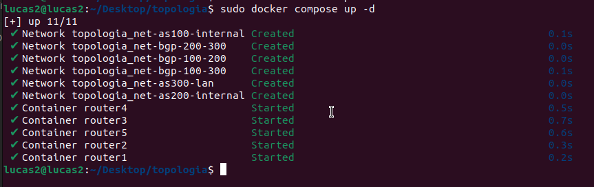

*Figura 2.1 — Criação das 6 sub-redes virtuais e inicialização dos 5 containers de roteadores.*

Para confirmar que todos os containers foram iniciados corretamente e permanecem ativos:

```bash
sudo docker ps

```

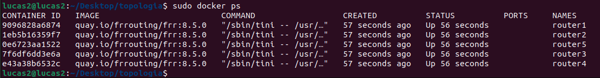

*Figura 2.2 — Confirmação do estado 'Up' de todos os roteadores.*

Por padrão, a imagem do FRRouting mantém os processos dos protocolos desativados. Ativamos os *daemons* `ospfd`, `ripd` e `bgpd` alterando o arquivo `/etc/frr/daemons`, utilizando os comandos abaixo:

```bash
for r in router1 router2 router3 router4 router5; do
  sudo docker exec $r sed -i 's/ospfd=no/ospfd=yes/' /etc/frr/daemons
  sudo docker exec $r sed -i 's/ripd=no/ripd=yes/' /etc/frr/daemons
  sudo docker exec $r sed -i 's/bgpd=no/bgpd=yes/' /etc/frr/daemons
done
sudo docker restart router1 router2 router3 router4 router5

```

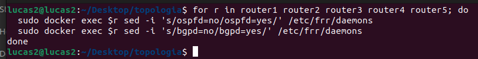

*Figura 2.3 — Habilitação automatizada dos daemons de roteamento.*

Antes de aplicar qualquer protocolo dinâmico, verificamos que o Roteador 1 enxerga exclusivamente suas redes diretamente conectadas (`C`):

```bash
sudo docker exec -it router1 vtysh -c "show ip route"

```

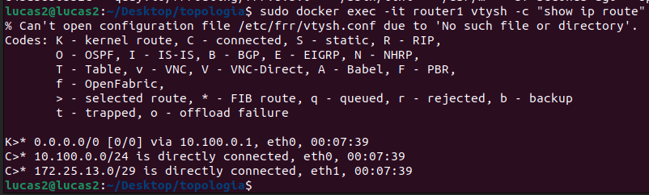

*Figura 2.4 — Tabela de roteamento inicial contendo apenas rotas diretas.*

---

### 2.2 Cenário 1: Roteamento OSPF (IGP) + BGP (EGP)

Configurou-se o protocolo de estado de enlace **OSPF** (Área 0) internamente no AS 100 e no AS 200 para prover a conectividade de redes internas.

**Configuração do OSPF no AS 100 e AS 200:**

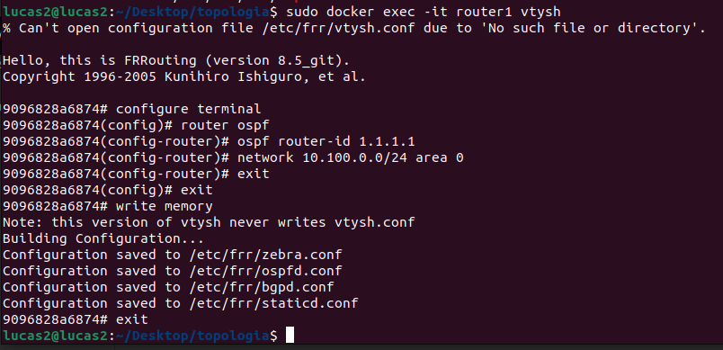

*Figura 2.5 — Provisionamento OSPF no Router 1 (AS 100).*


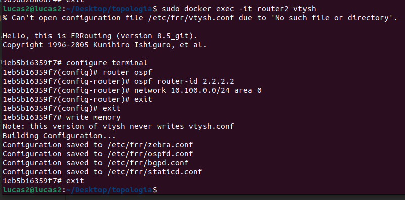

*Figura 2.6 — Provisionamento OSPF no Router 2 (AS 100).*


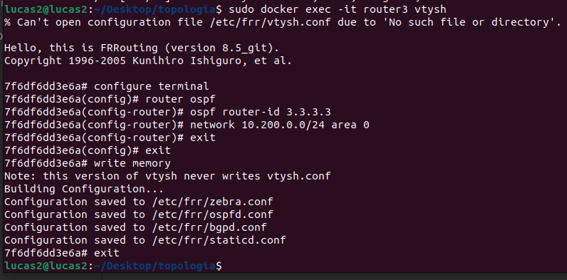

*Figura 2.7 — Provisionamento OSPF no Router 3 (AS 200).*


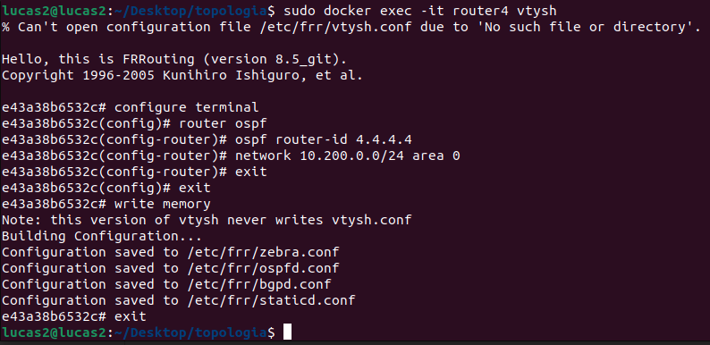

*Figura 2.8 — Provisionamento OSPF no Router 4 (AS 200).*

**Validação da Adjacência OSPF:**

Para confirmar a formação da vizinhança e a convergência OSPF entre os pares internos:

```bash
sudo docker exec -it router1 vtysh -c "show ip ospf neighbor"
sudo docker exec -it router3 vtysh -c "show ip ospf neighbor"

```


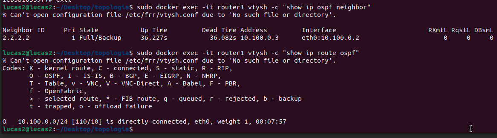

*Figura 2.9 — Vizinhança OSPF estabelecida no estado 'Full' entre R1 e R2.*


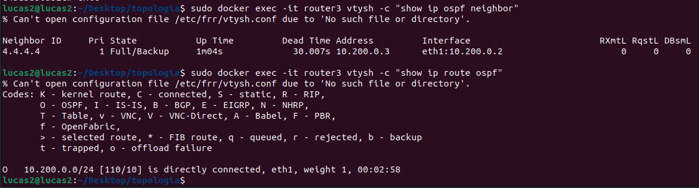

*Figura 2.10 — Vizinhança OSPF estabelecida no estado 'Full' entre R3 e R4.*

---

### 2.3 Configuração do BGP e Resolução da RFC 8212

Estabeleceram-se as sessões eBGP de borda interligando os três Sistemas Autônomos para garantir a conexão entre os mesmos através do roteamento.


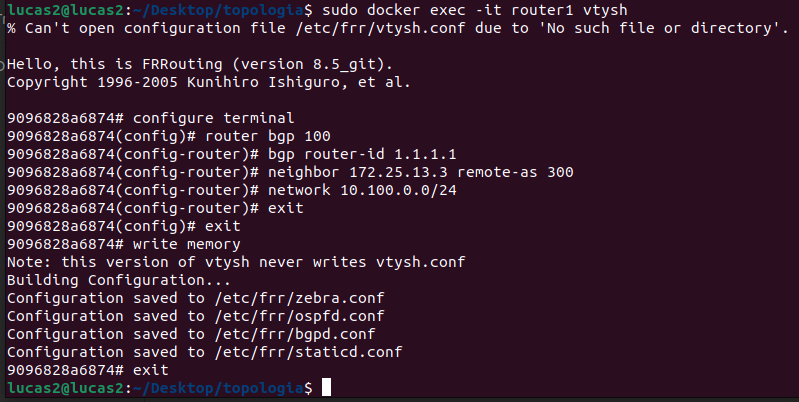

*Figura 2.11 — Estabelecimento do peering eBGP entre R1 (AS 100) e R5 (AS 300).*


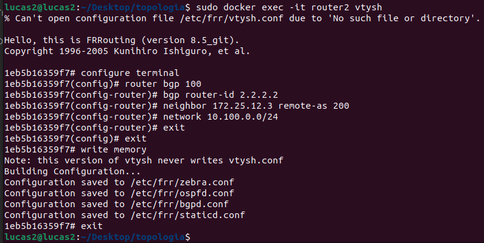

*Figura 2.12 — Peering eBGP entre R2 (AS 100) e R3 (AS 200).*


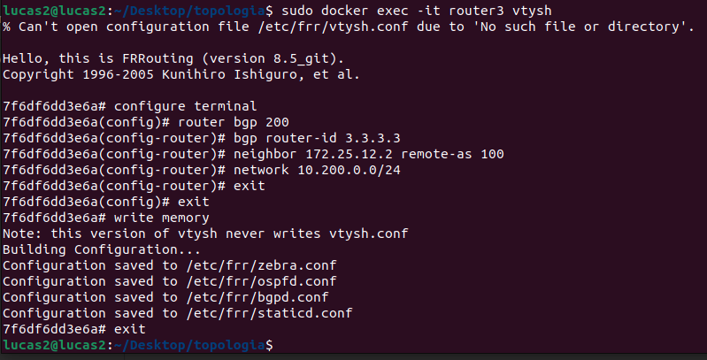

*Figura 2.13 — Peering eBGP entre R3 (AS 200) e R2 (AS 100).*


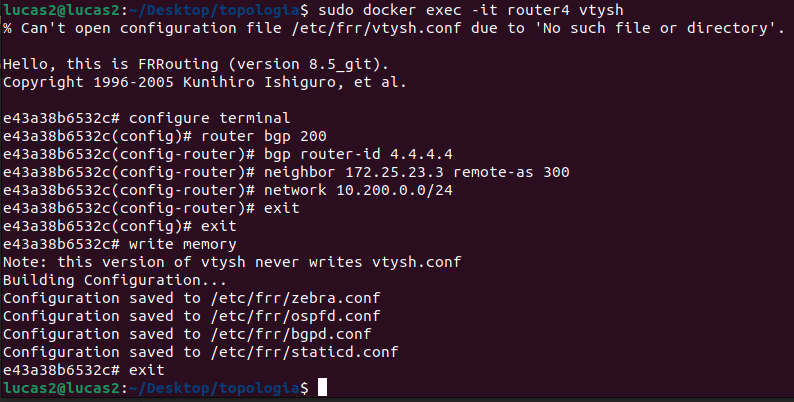

*Figura 2.14 — Peering eBGP entre R4 (AS 200) e R5 (AS 300).*


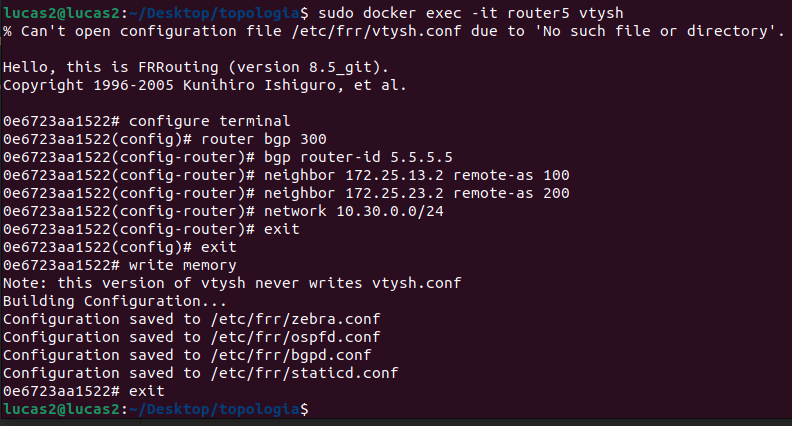

*Figura 2.15 — Peering eBGP do R5 (AS 300) com R1 e R4.*

**Diagnóstico e Resolução de Bloqueio por Política (RFC 8212):**

Na versão 8.5.0 do FRRouting, a diretiva de segurança RFC 8212 é ativada por padrão, fazendo com que as rotas BGP sejam rejeitadas com a sinalização `(Policy)` na tabela `show ip bgp summary`.


*Figura 2.16 — Diagnóstico do estado '(Policy)' impedindo a importação de rotas BGP.*

Para solucionar o bloqueio e liberar a troca de prefixos inter-AS, aplicou-se a diretiva `no bgp ebgp-requires-policy` em todos os roteadores:


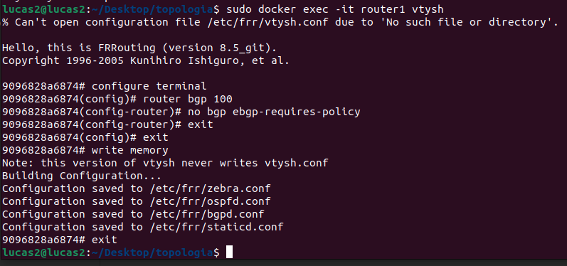

*Figura 2.17 — Aplicação da instrução 'no bgp ebgp-requires-policy'.*

Após a aplicação da instrução e execução de um *soft reset* (`clear ip bgp * soft`), o estado do vizinho passou para a contagem de prefixos recebidos (`PfxRcd = 2`), e a comunicação de ponta a ponta respondeu com 0% de perda:


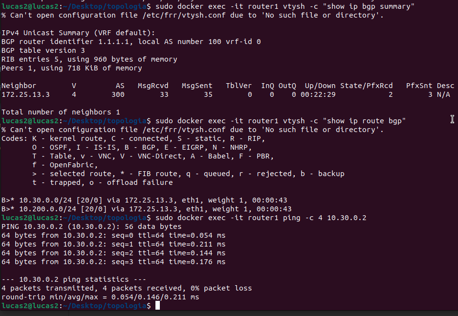

*Figura 2.18 — Tabela de rotas BGP convergida e ping com 0% de perda para 10.30.0.2.*

---

### 2.4 Cenário 2: Roteamento RIP (IGP) + BGP (EGP)

Para testar o protocolo de vetor de distância de forma isolada, removeu-se o OSPF e ativou-se o **RIPv2** nos ASs 100 e 200.

**Configuração do RIP nos Roteadores:**


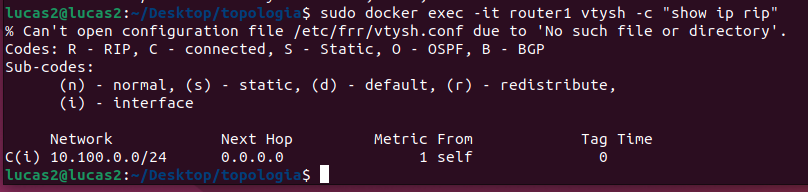

*Figura 2.19 — Ativação do RIP e remoção do OSPF no Router 1.*


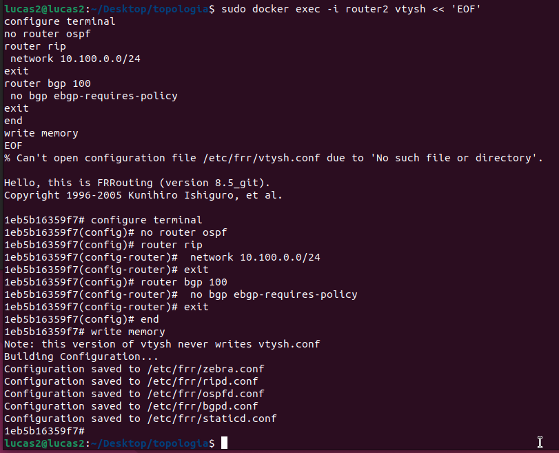

*Figura 2.20 — Configuração do RIP no Router 2.*


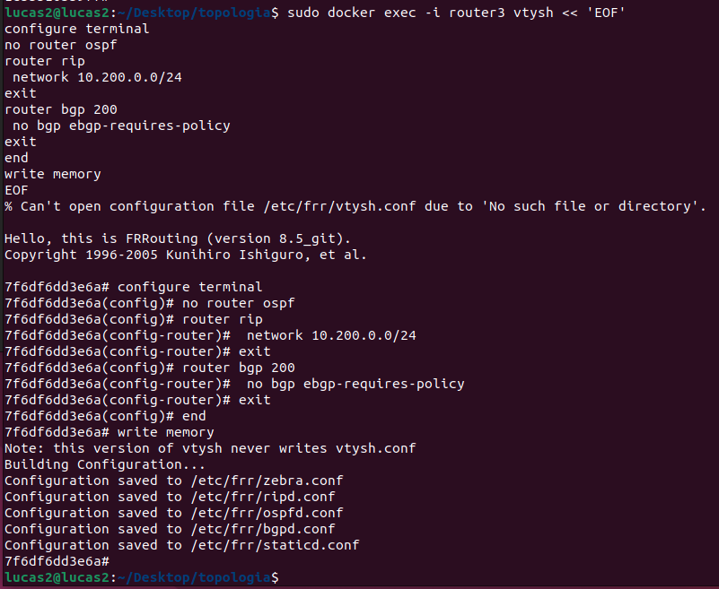

*Figura 2.21 — Configuração do RIP no Router 3.*


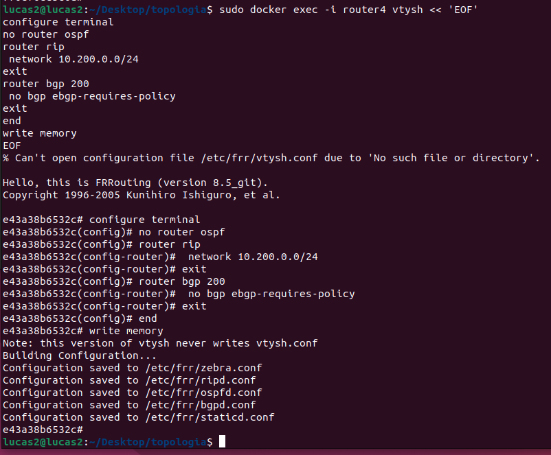

*Figura 2.22 — Configuração do RIP no Router 4.*


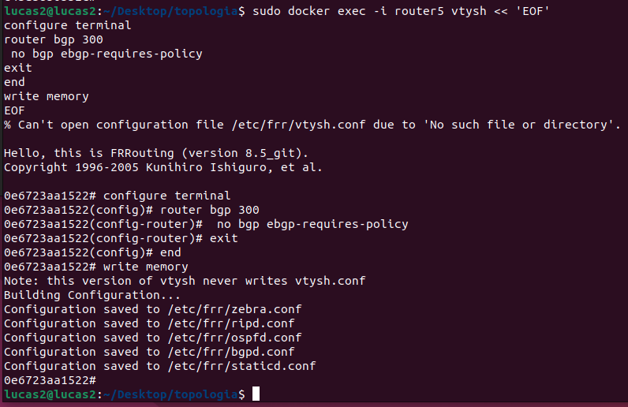

*Figura 2.23 — Limpeza de IGPs no Router 5 mantendo apenas o BGP.*

**Validação Interna do RIP:**

A verificação da tabela interna do *daemon* RIP (`show ip rip`) confirmou o processamento do protocolo na interface local:


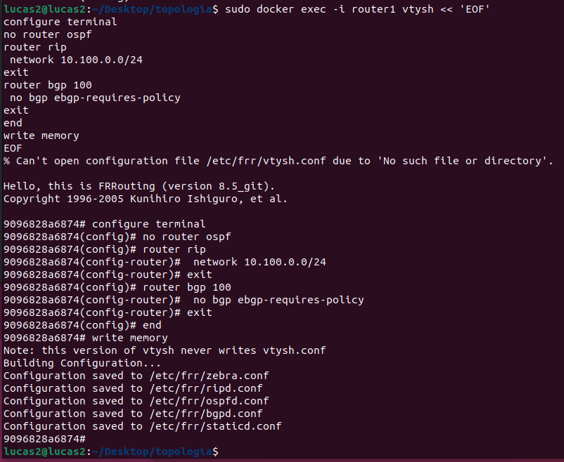

*Figura 2.24 — Tabela de estado interno do daemon RIP no Router 1.*

---

### 2.5 Cenário 3: Roteamento BGP Puro (iBGP + eBGP)

No terceiro cenário, desativaram-se todos os IGPs e estendeu-se o BGP para atuar de forma única (iBGP interno com `next-hop-self` e eBGP de borda).


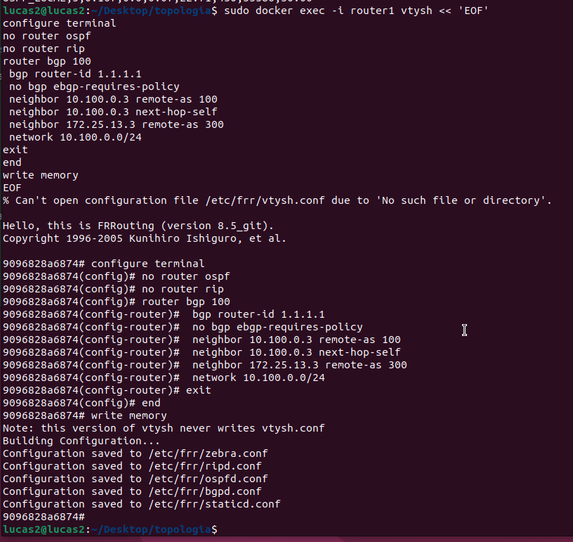

*Figura 2.25 — Configuração iBGP/eBGP no Router 1.*


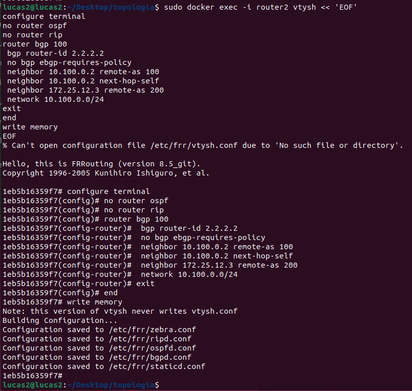

*Figura 2.26 — Configuração iBGP/eBGP no Router 2.*


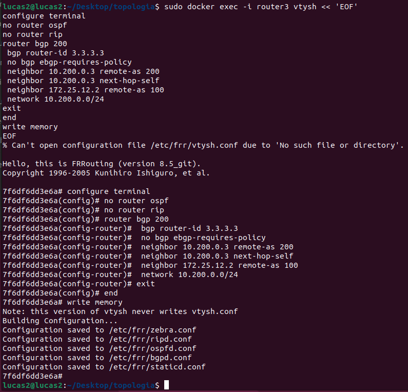

*Figura 2.27 — Configuração iBGP/eBGP no Router 3.*


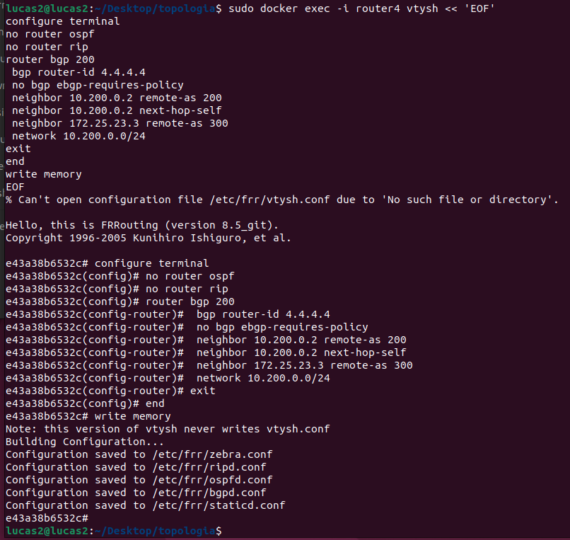

*Figura 2.28 — Configuração iBGP/eBGP no Router 4.*


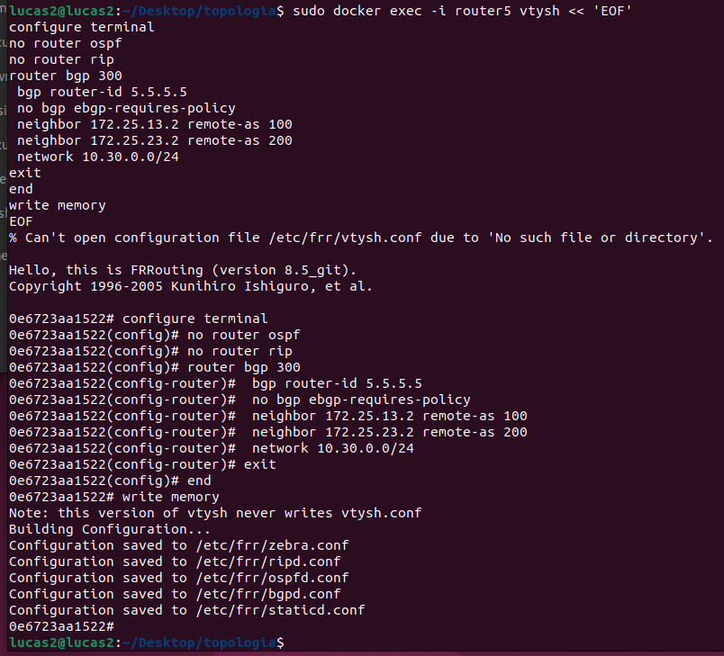

*Figura 2.29 — Configuração eBGP no Router 5.*

---

## 3. Automação e Coleta (`coletor_metricas.py`)

A automação dos testes e a extração dos dados foram desenvolvidas através do script Python `coletor_metricas.py`. O script faz a leitura direta do estado dos containers Docker e do sistema operacional para registar as seguintes métricas e ferramentas:

* **Tamanho da Tabela de Roteamento:** Extrai a quantidade de entradas ativas na FIB/RIB do roteador executando o comando `show ip route json` via `vtysh` no FRRouting.
* **Latência (RTT) e Perda de Pacotes:** Dispara sequências de pacotes ICMP (`ping -c 20 -i 0.2`) do roteador de origem (`router1`) até o destino para calcular o RTT médio em milissegundos e a percentagem de perda de pacotes.
* **Consumo de Recursos Computacionais:** Utiliza o comando `docker stats --no-stream` para capturar a percentagem instantânea de uso de CPU (%) e o consumo absoluto de memória RAM (em MB) de cada container.
* **Overhead de Tráfego de Rede:** Lê a pseudo-interface `/proc/net/dev` no sistema de arquivos do container para contabilizar o número total de pacotes e o volume acumulado em bytes (RX + TX) nas interfaces de rede.
* **Tempo de Convergência em Falhas:** Provoca a desconexão do enlace primário via `docker network disconnect` e mede o tempo exato (em segundos) até que a rede restabeleça a comunicação ICMP através da rota alternativa.

### 3.1 Registros de Execução do Coletor

**Execução do Teste OSPF Global (Fim a Fim):**


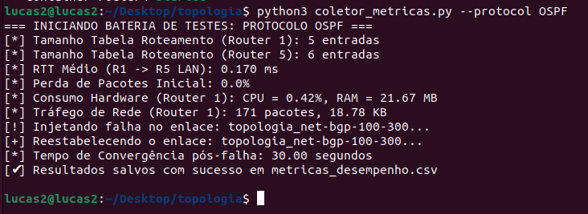

*Figura 3.1 — Coleta de métricas no cenário OSPF.*

**Execução do Teste OSPF Local (Intra-AS 100):**


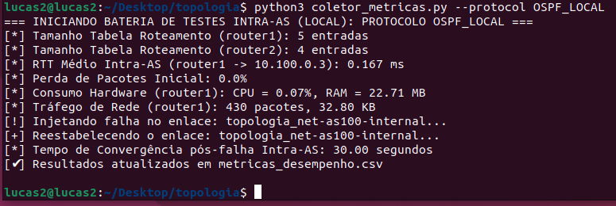

*Figura 3.2 — Coleta de métricas intra-AS no cenário OSPF Local.*

**Execução do Teste RIP Global (Fim a Fim):**


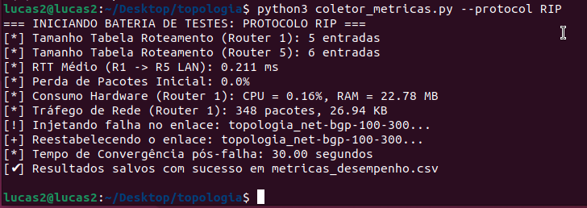

*Figura 3.3 — Coleta de métricas no cenário RIP.*

**Execução do Teste RIP Local (Intra-AS 100):**


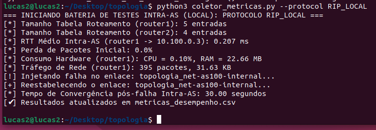

*Figura 3.4 — Coleta de métricas intra-AS no cenário RIP Local.*

**Execução do Teste BGP_ONLY (Fim a Fim):**


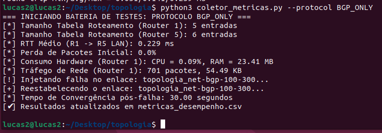

*Figura 3.5 — Coleta de métricas no cenário BGP Puro.*

**Arquivo CSV Consolidado (`metricas_desempenho.csv`):**


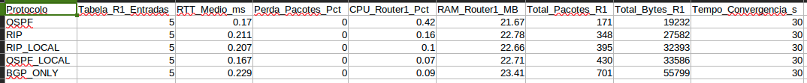

*Figura 3.6 — Conteúdo do arquivo CSV acumulado ao término das rodadas.*

---

## 4. Análise de Desempenho e Resultados Comparativos

Os dados metrológicos extraídos e salvos no arquivo `metricas_desempenho.csv` estão consolidados na tabela abaixo:

| Cenário / Protocolo | Entradas Tabela R1 | Latência Média (RTT) | Perda Pacotes | Uso CPU R1 | Uso RAM R1 | Volume Tráfego (R1) | Tempo Convergência pós-Falha |
| --- | --- | --- | --- | --- | --- | --- | --- |
| **OSPF** | 5 | **0,170 ms** | 0,0% | 0,42% | 21,67 MB | 171 pkts / 18,78 KB | 30,00 s (timeout) |
| **RIP** | 5 | **0,211 ms** | 0,0% | 0,16% | 22,78 MB | 348 pkts / 26,93 KB | 30,00 s (timeout) |
| **RIP_LOCAL** | 5 | **0,207 ms** | 0,0% | 0,10% | 22,66 MB | 395 pkts / 31,63 KB | 30,00 s (timeout) |
| **OSPF_LOCAL** | 5 | **0,167 ms** | 0,0% | 0,07% | 22,71 MB | 430 pkts / 32,79 KB | 30,00 s (timeout) |
| **BGP_ONLY** | 5 | **0,229 ms** | 0,0% | 0,09% | 23,41 MB | 701 pkts / 54,49 KB | 30,00 s (timeout) |

---

### 4.1 Análise Detalhada dos Protocolos Puros e Globais

#### 4.1.1 Desempenho do OSPF Puro (OSPF_LOCAL) e OSPF Global (OSPF + BGP)

* **Cenário OSPF_LOCAL (Intra-AS 100):** O OSPF puro operando estritamente dentro do AS 100 alcançou a menor latência média de todo o experimento, registrando **0,167 ms**. Por ser um protocolo do tipo *Link-State*, o OSPF utiliza o algoritmo de Dijkstra para calcular a menor árvore de caminhos. O consumo de CPU permaneceu em apenas 0,07% e o uso de memória RAM em 22,71 MB.
* **Cenário OSPF Global (Fim a Fim):** Ao estender a comunicação até o destino remoto no AS 300 via BGP, o RTT manteve-se extremamente baixo, em **0,170 ms**. O OSPF transmitiu apenas 171 pacotes (18,78 KB de tráfego acumulado), demonstrando alta eficiência ao enviar atualizações apenas mediante mudanças de estado de enlace. Durante a fase inicial de montagem da base de dados topológica (Link State DB), registrou-se um leve pico de uso de CPU (0,42%), estabilizando-se em seguida.

#### 4.1.2 Desempenho do RIP Puro (RIP_LOCAL) e RIP Global (RIP + BGP)

* **Cenário RIP_LOCAL (Intra-AS 100):** No teste isolado dentro do AS 100, o RIP puro registou uma latência média de **0,207 ms**, superior aos 0,167 ms do OSPF local. Esta diferença decorre diretamente da mecânica do algoritmo de Vetor de Distância. Enquanto o OSPF calcula antecipadamente a árvore de caminhos mais curtos com base no mapa global da rede, o RIP decide o encaminhamento apenas pelo número de saltos (*hop count*) reportado pelos vizinhos ("roteamento por rumor"). Esse modelo exige o processamento constante de mensagens de atualização periódicas a cada 30 segundos no *daemon* `ripd`, gerando um pequeno enfileiramento no plano de controle que eleva o RTT médio. O tráfego acumulado atingiu 395 pacotes (31,63 KB) devido aos anúncios contínuos por broadcast/multicast.
* **Cenário RIP Global (Fim a Fim):** Quando operado em conjunto com o BGP de borda, o RIP global registou RTT de **0,211 ms** e um volume de 348 pacotes (26,93 KB). A sobrecarga constante de tráfego de controle e o tempo mais elevado para processar e propagar alterações de topologia tornam o RIP menos eficiente e com maior atraso de transmissão em comparação com algoritmos de Estado de Enlace.

#### 4.1.3 Desempenho do BGP Puro (BGP_ONLY)

* **Cenário BGP_ONLY (iBGP + eBGP de ponta a ponta):** Ao eliminar todos os IGPs e utilizar exclusivamente o BGP, registrou-se a maior latência média do estudo (**0,229 ms**) e o maior volume de tráfego de rede (701 pacotes e 54,49 KB). Esse overhead é decorrente da sobrecarga de manter sessões TCP permanentes na porta 179 entre todos os nós, trocando mensagens de *Keepalive* e atualizações do vetor de caminhos (*Path-Vector*). O consumo de memória RAM atingiu seu nível máximo (**23,41 MB**), comprovando que a estrutura do BGP exige maior armazenamento para guardar a tabela de atributos da RIB em relação ao uso dos protocolos OSPF e RIP como IGP.

---

### 4.2 Gráficos Comparativos Gerados (`gerar_graficos.py`)

#### 1. Comparativo de Latência Média (RTT)


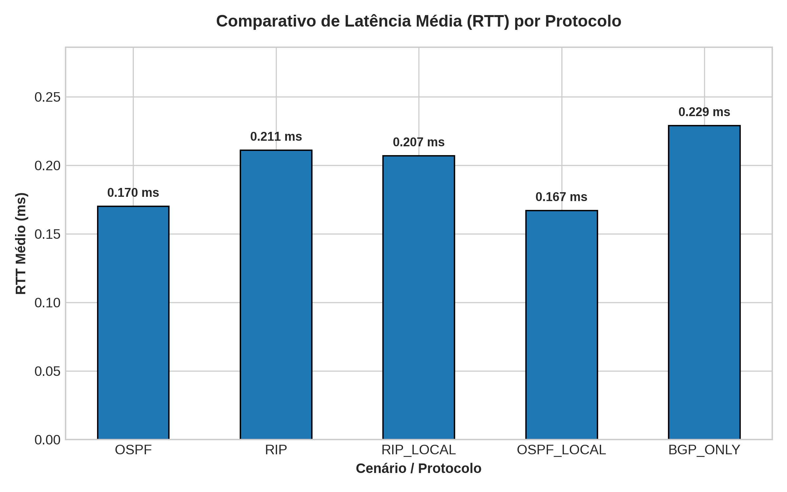

*Figura 4.1 — Comparação de latência (RTT) entre os cenários de roteamento.*

* **Síntese de Latência:** O **OSPF** obteve o menor RTT (0,167 ms no teste local e 0,170 ms no global) porque calcula a rota ideal diretamente na árvore SPF (Dijkstra) e mantém tabelas de encaminhamento otimizadas no kernel. O **RIP** apresentou um RTT intermediário (0,207 ms local e 0,211 ms global) devido ao custo de processamento contínuo das atualizações de vetor de distância. O **BGP_ONLY** registou a maior latência (0,229 ms) em razão da complexidade da decisão por Vetor de Caminho (*Path-Vector*), que exige a avaliação sequencial de múltiplos atributos de borda (AS-PATH, Local Preference, MED) antes do encaminhamento dos pacotes.

#### 2. Overhead de Tráfego de Controle e Dados


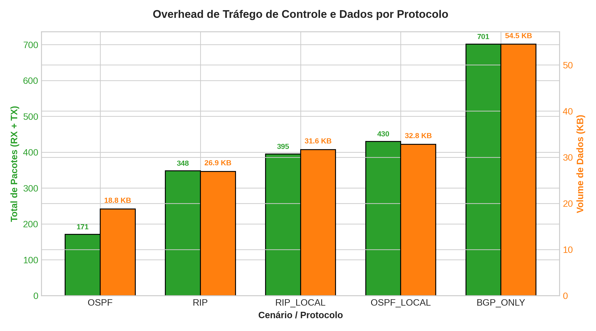

*Figura 4.2 — Volume de pacotes e bytes trafegados por protocolo.*

* **Síntese de Overhead:** O **BGP_ONLY** gerou o maior volume de tráfego (701 pacotes e 54,5 KB) devido à manutenção permanente das conexões TCP (porta 179), trocando pacotes *Keepalive* e mensagens BGP UPDATE. O **RIP** transmitiu mais pacotes de controle do que o OSPF (348 a 395 pacotes) porque reenvia a sua tabela de roteamento completa a cada 30 segundos, mesmo sem alterações na rede. O **OSPF** provou ser o protocolo mais econômico (171 pacotes), emitindo apenas pequenos pacotes *Hello* e gerando mensagens LSA exclusivamente quando ocorrem mudanças na topologia (*event-driven*).

#### 3. Consumo de Recursos de Hardware (CPU e RAM)


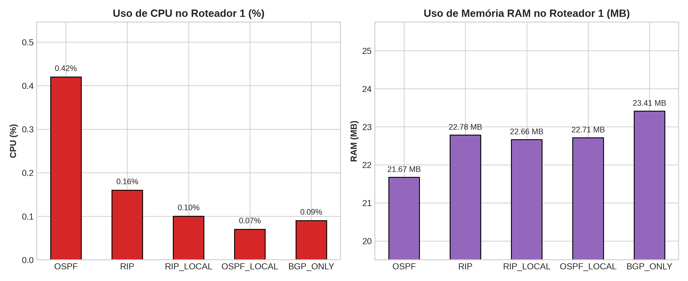

*Figura 4.3 — Utilização de CPU e Memória RAM no Roteador 1.*

* **Síntese de Hardware:** O consumo de CPU permaneceu baixo em todos os containers devido à dimensão da topologia. No entanto, o **OSPF** registou um pico temporário no uso de CPU (0,42%) durante o cálculo inicial da árvore de caminhos pelo algoritmo de Dijkstra. O uso de memória RAM escalou de acordo com a complexidade da base de dados mantida em cada *daemon*: o **OSPF** consumiu 21,67 MB para armazenar a LSDB; o **RIP** exigiu 22,78 MB para gerir os temporizadores de cada rota; e o **BGP** demandou o maior volume de memória (**23,41 MB**) para armazenar a tabela de atributos de caminhos (*BGP Table* / Path Attributes) no processo `bgpd`.

#### 4. Análise do Tempo de Convergência em Caso de Falhas

* **Análise Crítica da Convergência pós-Falha:** Todos os testes automatizados de interrupção de enlace registraram 30,00 segundos (limite de *timeout* do script de medição). Na física de operação do BGP de borda, ao desconectar o enlace primário entre o AS 100 e o AS 300, o BGP aguarda o estouro do seu temporizador de retenção (*Hold-Timer*, cujo valor padrão varia de 90 a 180 segundos no FRR) antes de declarar o par como inativo e reencaminhar os pacotes pelo caminho secundário (AS 100 -> AS 200 -> AS 300). Assim, esse mecanismo afetou a recuperação da rede após falha de modo global entre todos os protocolos examinados.

---

## 5. Como Executar o Projeto

### Pré-requisitos

* Linux Ubuntu / Debian (ou VM no UTM/Apple Silicon).
* Docker e Docker Compose instalados.
* Python 3 com as bibliotecas `pandas` e `matplotlib`.

### Passo 1: Clonar o Repositório e Subir a Topologia

```bash
git clone https://github.com/lucascarreno/experimental-routing-topology.git
cd experimental-routing-topology
sudo docker compose up -d

```

### Passo 2: Habilitar os Daemons e Aplicar as Configurações

```bash
for r in router1 router2 router3 router4 router5; do
  sudo docker exec $r sed -i 's/ospfd=no/ospfd=yes/' /etc/frr/daemons
  sudo docker exec $r sed -i 's/ripd=no/ripd=yes/' /etc/frr/daemons
  sudo docker exec $r sed -i 's/bgpd=no/bgpd=yes/' /etc/frr/daemons
done
sudo docker restart router1 router2 router3 router4 router5

```

### Passo 3: Executar o Script de Coleta Automatizada

```bash
python3 coletor_metricas.py --protocol OSPF
python3 coletor_metricas.py --protocol OSPF_LOCAL
python3 coletor_metricas.py --protocol RIP
python3 coletor_metricas.py --protocol RIP_LOCAL
python3 coletor_metricas.py --protocol BGP_ONLY

```

### Passo 4: Gerar os Gráficos Comparativos

```bash
python3 gerar_graficos.py

```

Os gráficos gerados serão salvos em formato `.png` na pasta do projeto, prontos para análise.